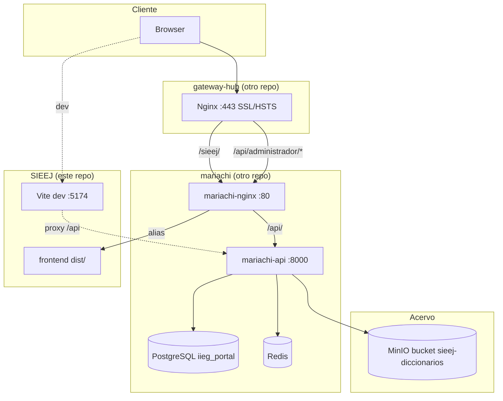

# SIEEJ — Arquitectura

> **Nota:** este documento describe el flujo de request/response y la
> infraestructura. Para el detalle del modelo de datos, endpoints,
> schema JSONB de la `definicion`, frontend renderer y constructor
> visual, ver **`docs/plataforma-formularios.md`**.

## Diagrama de componentes



## Flujo de request en producción

1. `https://<APP_DOMAIN>/sieej/` llega al gateway-hub.
2. Gateway aplica TLS, security headers, rate limit, bot-protection.
3. `proxy_pass http://portal` → upstream `portal` = `mariachi-nginx:80`.
4. mariachi-nginx hace match con `location /sieej { alias ...; try_files ... /sieej/index.html; }`.
5. Sirve el SPA (React).
6. SPA hace `fetch('/api/administrador/formularios/catalogos')`:
   Browser → gateway → portal → mariachi-nginx → `location /api/` → mariachi-api FastAPI.
7. mariachi-api valida cookie HttpOnly + CSRF, ejecuta query en `iieg_portal.sieej.*`, responde.
8. Subida de diccionario: `POST /api/administrador/formularios/bases-datos/{id}/diccionario`
   → mariachi-api → `AcervoClient.upload_file()` → MinIO bucket `sieej-diccionarios`.

## Flujo de request en desarrollo

1. Browser → `http://localhost:5174/`.
2. Vite Dev Server sirve `index.html` y modulos con HMR.
3. `fetch('/api/administrador/...')` cae en el proxy Vite.
4. Vite reenvia a `BACKEND_DEV_TARGET=http://host.docker.internal:8000` (mariachi-api).
5. mariachi-api valida y responde.

## Componentes

### Frontend (este repo)

- `main.jsx` instancia `BrowserRouter` con `basename={VITE_BASE_PATH}` y monta:
  ```
  GlobalProvider > AuthProvider > <Routes/>
  ```
  Dentro de `MainLayout` (montado solo cuando hay sesion via
  `ProtectedRoute`):
  ```
  CatalogosProvider > FormsProvider > <Outlet/>
  ```
- `AuthContext`: cookie HttpOnly + CSRF, `onFetch` con `credentials:'include'`,
  inyeccion automatica de `X-CSRF-Token` en mutaciones, auto-logout en 401.
  `setUser` siempre pasa por `helpers/normalizeUser.js` que deriva
  `nombre`/`apellido` desde `user.name` cuando solo viene como string.
- `CatalogosContext` (`forms/context/CatalogosContext.jsx`): cuando
  `isAuthenticated`, hace `GET /formularios/catalogos` y expone
  `catalogos: { unidades_admin, categoria_datos, ... }` con las
  **mismas keys** que el JSONB de la `definicion` declara en
  `field.catalog`. Cleanup con `AbortController`.
- `FormsContext` (`forms/context/FormsContext.jsx`): lista de
  formularios visibles para el usuario. El header del layout lee de
  aqui para el badge de incompletos.
- `SubmissionContext` + `WizardContext`: scoped al `FormPage`
  (un envio activo + estado de navegacion del wizard).

### Backend (mariachi/api modulo formularios)

- `app/api/routes/formularios/__init__.py`: router padre con
  `prefix='/formularios'` y `dependencies=[Depends(require_project_access('sieej'))]`.
- Subrouters: `general`, `enlaces`, `bases_datos`, `catalogos`.
- Servicios en `app/services/sieej/`.
- Modelos en schema `sieej` (8 catalogos + 3 entidades + 1 N:M).
- Migration `e7f8a9b0c1d2` aplica DDL + seeds + crea
  `MediaBucket(acervo_bucket='sieej-diccionarios')`.

### Infra

- mariachi-nginx: sirve `admin/dist` en `/mariachi`, `sieej/dist` en
  `/sieej`, proxy `/api/` a mariachi-api.
- gateway-hub: proxy reverso publico, TLS, locations por prefijo,
  rate limit, security headers.
- Acervo: MinIO con bucket dedicado `sieej-diccionarios`.

## Seguridad

- TLS terminado en gateway-hub (TLSv1.2/1.3, HSTS preload, OCSP stapling).
- CSP, X-Frame-Options, X-Content-Type-Options, Referrer-Policy en gateway-hub.
- Rate limit por IP: `general=10r/s burst=150` para `/sieej/`,
  `api=10r/s burst=20` para `/api/`.
- Auth: cookie HttpOnly + samesite + (en prod) secure; CSRF en header
  `X-CSRF-Token` validado en POST/PUT/DELETE/PATCH.
- Backend: `require_project_access('sieej')` valida membership; admin
  global (rol `tetlamamakani`) bypass.

## Performance

- `dist/` con assets hasheados, cache `immutable`; `index.html` `no-cache`.
- Backend: Gunicorn con `GUNICORN_WORKERS` configurable; pool SQLAlchemy
  con `DB_POOL_SIZE` + `DB_MAX_OVERFLOW`.
- Acervo cliente cacheado por bucket (`AcervoClient._cache`).
